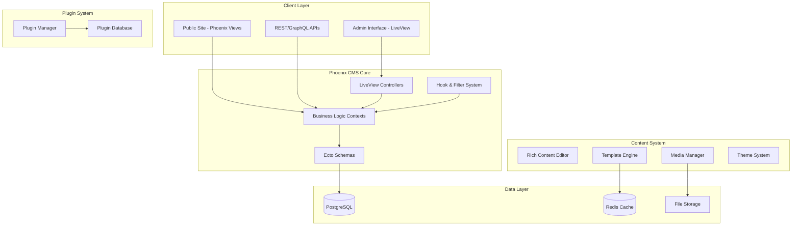

# WordPress-Equivalent Phoenix CMS Design

## Architecture Overview

This design creates a complete WordPress-equivalent CMS built in Phoenix/Elixir that can import WordPress SQL dumps and provide all WordPress functionality with modern Phoenix LiveView interfaces.



## Database Schema Design

### Core WordPress-Compatible Schema

```elixir
# Posts table - handles all content types
defmodule PhoenixCMS.Content.Post do
  use Ecto.Schema
  
  schema "posts" do
    field :title, :string
    field :content, :string
    field :excerpt, :string
    field :status, Ecto.Enum, values: [:publish, :draft, :private, :trash]
    field :post_type, :string, default: "post"
    field :slug, :string
    field :password, :string
    field :comment_status, Ecto.Enum, values: [:open, :closed]
    field :ping_status, Ecto.Enum, values: [:open, :closed]
    field :menu_order, :integer, default: 0
    field :post_parent_id, :id
    field :guid, :string
    field :comment_count, :integer, default: 0
    
    belongs_to :author, PhoenixCMS.Accounts.User
    belongs_to :parent, __MODULE__
    has_many :children, __MODULE__, foreign_key: :post_parent_id
    has_many :meta, PhoenixCMS.Content.PostMeta
    has_many :comments, PhoenixCMS.Content.Comment
    many_to_many :terms, PhoenixCMS.Taxonomy.Term, join_through: "post_term_relationships"
    
    timestamps()
  end
end

# Meta table for extensible key-value storage
defmodule PhoenixCMS.Content.PostMeta do
  use Ecto.Schema
  
  schema "post_meta" do
    field :meta_key, :string
    field :meta_value, :string
    
    belongs_to :post, PhoenixCMS.Content.Post
    
    timestamps()
  end
end

# Users with WordPress-compatible roles
defmodule PhoenixCMS.Accounts.User do
  use Ecto.Schema
  
  schema "users" do
    field :login, :string
    field :email, :string
    field :display_name, :string
    field :first_name, :string
    field :last_name, :string
    field :nickname, :string
    field :password_hash, :string
    field :status, Ecto.Enum, values: [:active, :inactive, :pending]
    field :role, :string, default: "subscriber"
    
    has_many :posts, PhoenixCMS.Content.Post, foreign_key: :author_id
    has_many :meta, PhoenixCMS.Accounts.UserMeta
    has_many :comments, PhoenixCMS.Content.Comment
    
    timestamps()
  end
end

# Taxonomy system (categories, tags, custom taxonomies)
defmodule PhoenixCMS.Taxonomy.Term do
  use Ecto.Schema
  
  schema "terms" do
    field :name, :string
    field :slug, :string
    field :description, :string
    field :count, :integer, default: 0
    field :parent_id, :id
    
    belongs_to :taxonomy, PhoenixCMS.Taxonomy.Taxonomy
    belongs_to :parent, __MODULE__
    has_many :children, __MODULE__, foreign_key: :parent_id
    has_many :meta, PhoenixCMS.Taxonomy.TermMeta
    many_to_many :posts, PhoenixCMS.Content.Post, join_through: "post_term_relationships"
    
    timestamps()
  end
end

defmodule PhoenixCMS.Taxonomy.Taxonomy do
  use Ecto.Schema
  
  schema "taxonomies" do
    field :name, :string
    field :label, :string
    field :description, :string
    field :hierarchical, :boolean, default: false
    field :public, :boolean, default: true
    field :object_type, {:array, :string}
    
    has_many :terms, PhoenixCMS.Taxonomy.Term
    
    timestamps()
  end
end
```

## WordPress SQL Import System

### Import Engine Design

```elixir
defmodule PhoenixCMS.Import.WordPressImporter do
  @moduledoc """
  Imports WordPress SQL dumps into Phoenix CMS
  """
  
  def import_sql_file(file_path) do
    with {:ok, sql_content} <- File.read(file_path),
         {:ok, parsed_data} <- parse_wordpress_sql(sql_content),
         {:ok, _result} <- import_data(parsed_data) do
      {:ok, "Import completed successfully"}
    else
      {:error, reason} -> {:error, reason}
    end
  end
  
  defp parse_wordpress_sql(sql_content) do
    # Parse WordPress SQL structure
    tables = %{
      posts: extract_table_data(sql_content, "wp_posts"),
      users: extract_table_data(sql_content, "wp_users"),
      postmeta: extract_table_data(sql_content, "wp_postmeta"),
      terms: extract_table_data(sql_content, "wp_terms"),
      term_taxonomy: extract_table_data(sql_content, "wp_term_taxonomy"),
      term_relationships: extract_table_data(sql_content, "wp_term_relationships"),
      comments: extract_table_data(sql_content, "wp_comments"),
      options: extract_table_data(sql_content, "wp_options")
    }
    
    {:ok, tables}
  end
  
  defp import_data(tables) do
    Ecto.Multi.new()
    |> Ecto.Multi.run(:users, fn repo, _changes ->
      import_users(repo, tables.users)
    end)
    |> Ecto.Multi.run(:taxonomies, fn repo, _changes ->
      import_taxonomies(repo, tables.term_taxonomy)
    end)
    |> Ecto.Multi.run(:terms, fn repo, _changes ->
      import_terms(repo, tables.terms)
    end)
    |> Ecto.Multi.run(:posts, fn repo, _changes ->
      import_posts(repo, tables.posts)
    end)
    |> Ecto.Multi.run(:postmeta, fn repo, _changes ->
      import_postmeta(repo, tables.postmeta)
    end)
    |> Ecto.Multi.run(:comments, fn repo, _changes ->
      import_comments(repo, tables.comments)
    end)
    |> Repo.transaction()
  end
  
  defp import_posts(repo, wp_posts) do
    posts = Enum.map(wp_posts, fn wp_post ->
      %{
        id: wp_post["ID"],
        title: wp_post["post_title"],
        content: convert_wordpress_content(wp_post["post_content"]),
        excerpt: wp_post["post_excerpt"],
        status: convert_post_status(wp_post["post_status"]),
        post_type: wp_post["post_type"],
        slug: wp_post["post_name"],
        author_id: wp_post["post_author"],
        post_parent_id: wp_post["post_parent"],
        inserted_at: wp_post["post_date"],
        updated_at: wp_post["post_modified"]
      }
    end)
    
    {count, _} = repo.insert_all(PhoenixCMS.Content.Post, posts)
    {:ok, count}
  end
  
  defp convert_wordpress_content(content) do
    content
    |> convert_shortcodes()
    |> convert_wordpress_blocks()
    |> update_media_urls()
  end
  
  defp convert_shortcodes(content) do
    # Convert WordPress shortcodes to Phoenix equivalents
    content
    |> String.replace(~r/\[gallery.*?\]/, "<div class=\"gallery\"><!-- Gallery placeholder --></div>")
    |> String.replace(~r/\[caption.*?\](.*?)\[\/caption\]/s, "<figure class=\"wp-caption\">\\1</figure>")
  end
end
```

## Rich Content Editor System

### Block-Based Editor with LiveView

```elixir
defmodule PhoenixCMSWeb.EditorLive do
  use PhoenixCMSWeb, :live_view
  
  def mount(_params, _session, socket) do
    {:ok, 
     socket
     |> assign(:blocks, [])
     |> assign(:selected_block, nil)
     |> assign(:media_library_open, false)}
  end
  
  def handle_event("add_block", %{"type" => type}, socket) do
    new_block = create_block(type)
    blocks = socket.assigns.blocks ++ [new_block]
    
    {:noreply, assign(socket, :blocks, blocks)}
  end
  
  def handle_event("update_block", %{"id" => id, "content" => content}, socket) do
    blocks = Enum.map(socket.assigns.blocks, fn block ->
      if block.id == id do
        %{block | content: content}
      else
        block
      end
    end)
    
    {:noreply, assign(socket, :blocks, blocks)}
  end
  
  def handle_event("open_media_library", _params, socket) do
    {:noreply, assign(socket, :media_library_open, true)}
  end
  
  defp create_block(type) do
    %{
      id: Ecto.UUID.generate(),
      type: type,
      content: default_content_for_type(type),
      settings: %{}
    }
  end
  
  defp default_content_for_type("paragraph"), do: ""
  defp default_content_for_type("heading"), do: ""
  defp default_content_for_type("image"), do: %{src: "", alt: "", caption: ""}
  defp default_content_for_type("gallery"), do: %{images: []}
end
```

### Media Management System

```elixir
defmodule PhoenixCMS.Media do
  @moduledoc """
  Media management system with WordPress-compatible functionality
  """
  
  def upload_file(upload, user_id) do
    with {:ok, file_info} <- process_upload(upload),
         {:ok, attachment} <- create_attachment(file_info, user_id) do
      {:ok, attachment}
    end
  end
  
  defp process_upload(upload) do
    # Generate multiple sizes like WordPress
    sizes = generate_image_sizes(upload)
    
    file_info = %{
      original: upload,
      sizes: sizes,
      mime_type: upload.content_type,
      file_size: File.stat!(upload.path).size
    }
    
    {:ok, file_info}
  end
  
  defp generate_image_sizes(upload) do
    if image?(upload.content_type) do
      %{
        thumbnail: resize_image(upload, {150, 150}),
        medium: resize_image(upload, {300, 300}),
        large: resize_image(upload, {1024, 1024}),
        full: upload
      }
    else
      %{full: upload}
    end
  end
  
  defp create_attachment(file_info, user_id) do
    attrs = %{
      title: Path.basename(file_info.original.filename, Path.extname(file_info.original.filename)),
      content: "",
      status: :inherit,
      post_type: "attachment",
      author_id: user_id,
      meta: [
        %{meta_key: "_wp_attached_file", meta_value: file_info.original.filename},
        %{meta_key: "_wp_attachment_metadata", meta_value: Jason.encode!(file_info.sizes)}
      ]
    }
    
    PhoenixCMS.Content.create_post(attrs)
  end
end
```

## Plugin Architecture System

### Plugin Manager

```elixir
defmodule PhoenixCMS.Plugins.Manager do
  @moduledoc """
  Plugin management system similar to WordPress
  """
  
  def install_plugin(plugin_path) do
    with {:ok, plugin_info} <- read_plugin_info(plugin_path),
         :ok <- validate_plugin(plugin_info),
         {:ok, _} <- register_plugin(plugin_info) do
      {:ok, "Plugin installed successfully"}
    end
  end
  
  def activate_plugin(plugin_name) do
    with {:ok, plugin} <- get_plugin(plugin_name),
         :ok <- load_plugin_module(plugin),
         :ok <- run_activation_hooks(plugin) do
      update_plugin_status(plugin_name, :active)
    end
  end
  
  defp load_plugin_module(plugin) do
    # Dynamically load plugin module
    Code.compile_file(plugin.main_file)
    :ok
  end
  
  defp run_activation_hooks(plugin) do
    if function_exported?(plugin.module, :activate, 0) do
      plugin.module.activate()
    end
    :ok
  end
end

# Plugin behavior
defmodule PhoenixCMS.Plugin do
  @callback activate() :: :ok | {:error, term()}
  @callback deactivate() :: :ok | {:error, term()}
  @callback install() :: :ok | {:error, term()}
  @callback uninstall() :: :ok | {:error, term()}
  
  defmacro __using__(_opts) do
    quote do
      @behaviour PhoenixCMS.Plugin
      
      def activate, do: :ok
      def deactivate, do: :ok
      def install, do: :ok
      def uninstall, do: :ok
      
      defoverridable activate: 0, deactivate: 0, install: 0, uninstall: 0
    end
  end
end
```

### Hook and Filter System

```elixir
defmodule PhoenixCMS.Hooks do
  @moduledoc """
  WordPress-style hook and filter system
  """
  
  use GenServer
  
  def start_link(_opts) do
    GenServer.start_link(__MODULE__, %{}, name: __MODULE__)
  end
  
  def add_action(hook_name, callback, priority \\ 10) do
    GenServer.call(__MODULE__, {:add_action, hook_name, callback, priority})
  end
  
  def add_filter(hook_name, callback, priority \\ 10) do
    GenServer.call(__MODULE__, {:add_filter, hook_name, callback, priority})
  end
  
  def do_action(hook_name, args \\ []) do
    GenServer.call(__MODULE__, {:do_action, hook_name, args})
  end
  
  def apply_filters(hook_name, value, args \\ []) do
    GenServer.call(__MODULE__, {:apply_filters, hook_name, value, args})
  end
  
  # GenServer callbacks
  def init(state) do
    {:ok, %{actions: %{}, filters: %{}}}
  end
  
  def handle_call({:add_action, hook_name, callback, priority}, _from, state) do
    actions = Map.update(state.actions, hook_name, [{priority, callback}], fn existing ->
      [{priority, callback} | existing] |> Enum.sort_by(&elem(&1, 0))
    end)
    
    {:reply, :ok, %{state | actions: actions}}
  end
  
  def handle_call({:do_action, hook_name, args}, _from, state) do
    callbacks = Map.get(state.actions, hook_name, [])
    
    Enum.each(callbacks, fn {_priority, callback} ->
      apply(callback, args)
    end)
    
    {:reply, :ok, state}
  end
  
  def handle_call({:apply_filters, hook_name, value, args}, _from, state) do
    callbacks = Map.get(state.filters, hook_name, [])
    
    result = Enum.reduce(callbacks, value, fn {_priority, callback}, acc ->
      apply(callback, [acc | args])
    end)
    
    {:reply, result, state}
  end
end
```

## Theme System

### Theme Engine

```elixir
defmodule PhoenixCMS.Themes do
  @moduledoc """
  WordPress-style theme system with template hierarchy
  """
  
  def get_template(post_type, template_name \\ nil) do
    theme_path = get_active_theme_path()
    
    template_hierarchy = build_template_hierarchy(post_type, template_name)
    
    Enum.find_value(template_hierarchy, fn template ->
      template_path = Path.join(theme_path, "#{template}.html.heex")
      if File.exists?(template_path), do: template_path
    end) || Path.join(theme_path, "index.html.heex")
  end
  
  defp build_template_hierarchy("post", nil) do
    ["single-post", "single", "index"]
  end
  
  defp build_template_hierarchy("page", nil) do
    ["page", "index"]
  end
  
  defp build_template_hierarchy(post_type, template_name) when is_binary(template_name) do
    ["#{template_name}-#{post_type}", template_name, "single-#{post_type}", "single", "index"]
  end
  
  defp build_template_hierarchy(post_type, nil) do
    ["single-#{post_type}", "single", "index"]
  end
end

# Theme configuration
defmodule PhoenixCMS.Theme do
  defstruct [:name, :version, :description, :author, :template_path, :assets_path]
  
  def load_theme_info(theme_path) do
    style_css = Path.join(theme_path, "style.css")
    
    if File.exists?(style_css) do
      parse_theme_header(style_css)
    else
      {:error, "Invalid theme: style.css not found"}
    end
  end
  
  defp parse_theme_header(style_css) do
    content = File.read!(style_css)
    
    # Parse WordPress-style theme headers
    name = extract_header(content, "Theme Name")
    version = extract_header(content, "Version")
    description = extract_header(content, "Description")
    author = extract_header(content, "Author")
    
    {:ok, %__MODULE__{
      name: name,
      version: version,
      description: description,
      author: author
    }}
  end
end
```

This design provides a comprehensive WordPress-equivalent CMS built in Phoenix that can import WordPress SQL dumps and provide all the functionality clients expect from WordPress.